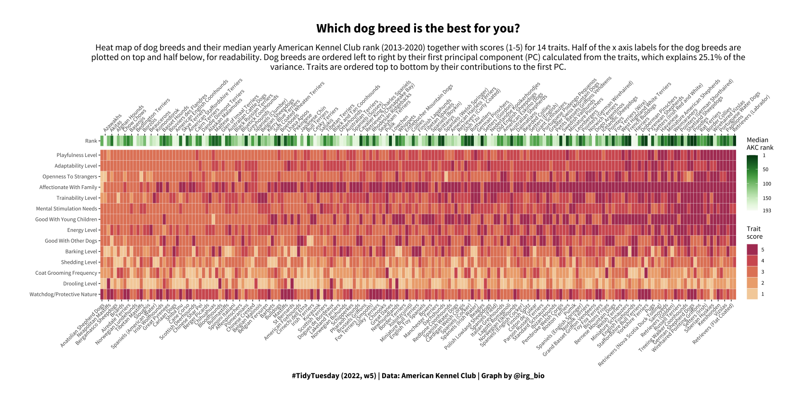
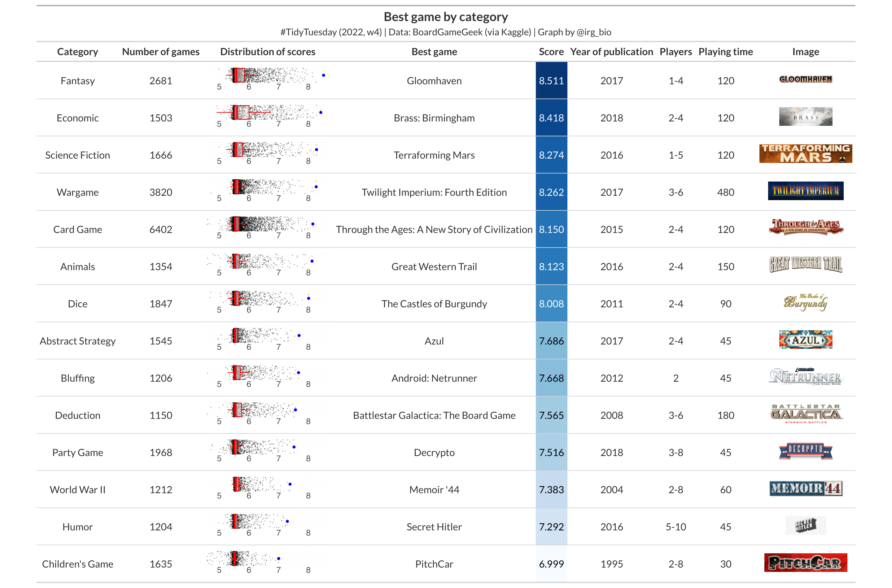
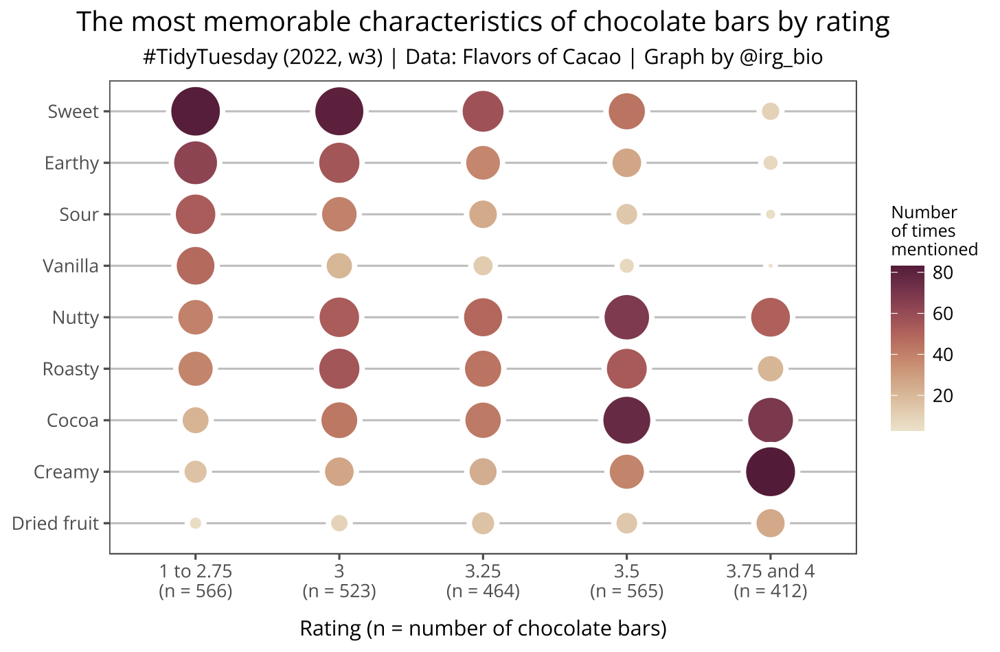
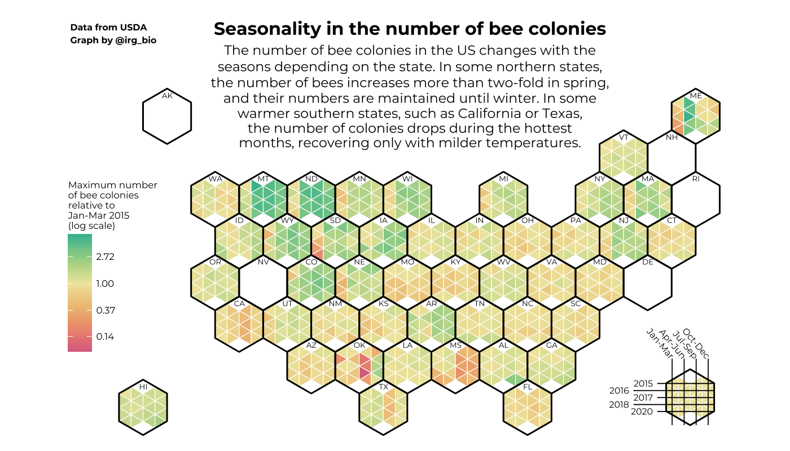

About
================

This repo is for showing the code and the final graphs for
the [TidyTuesday](https://github.com/rfordatascience/tidytuesday)
project.

Submissions
================

## 2022-02-01

## 2022-01-25

## 2022-01-18

## 2022-01-11

