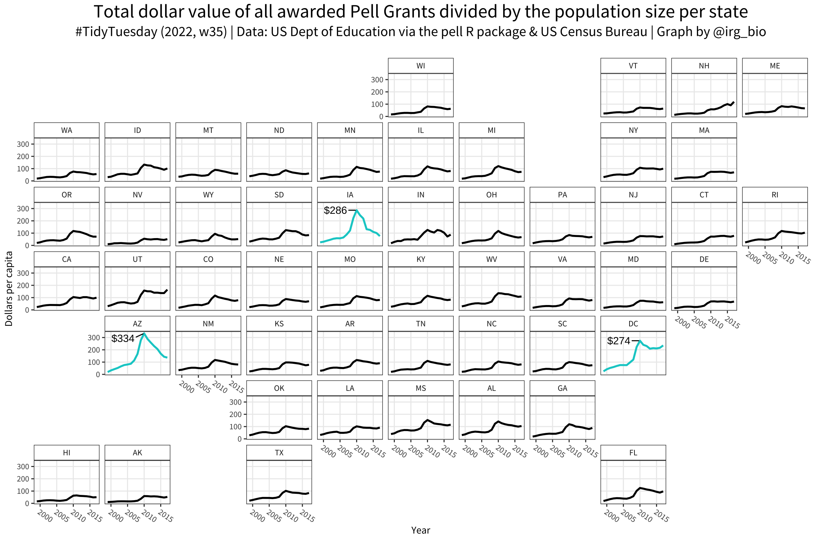
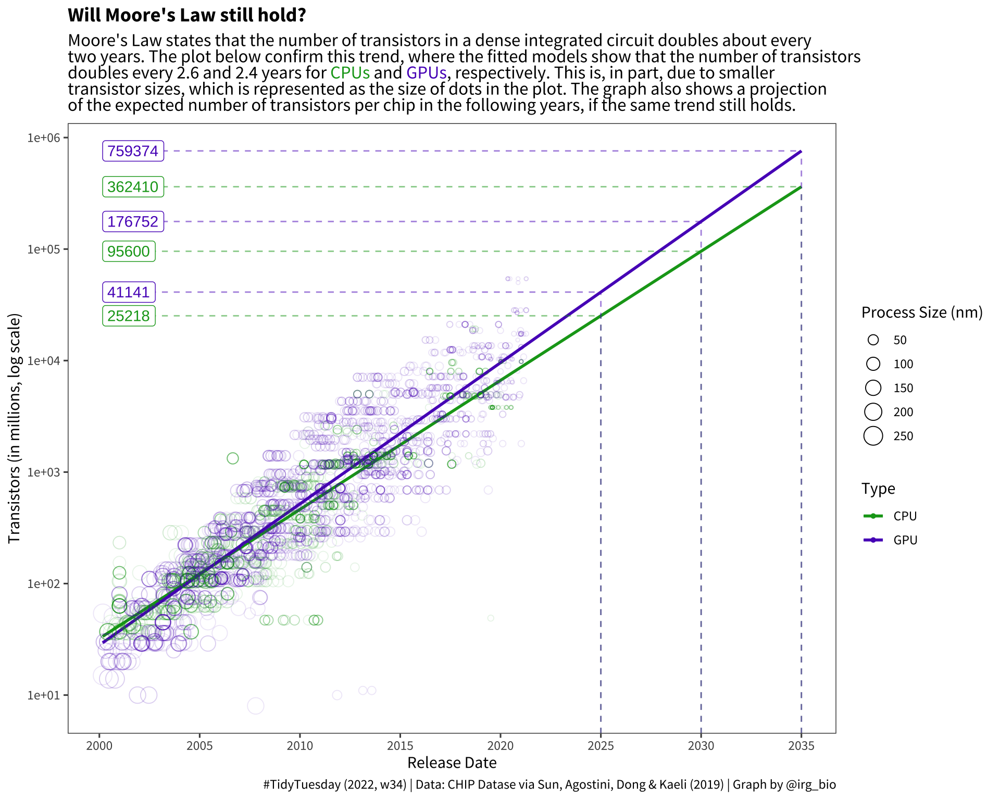
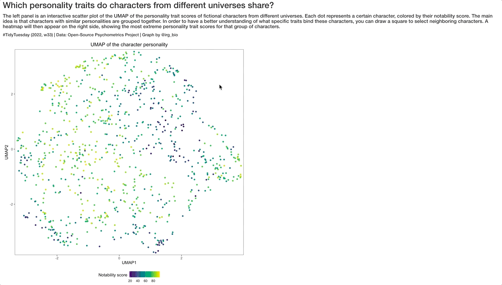
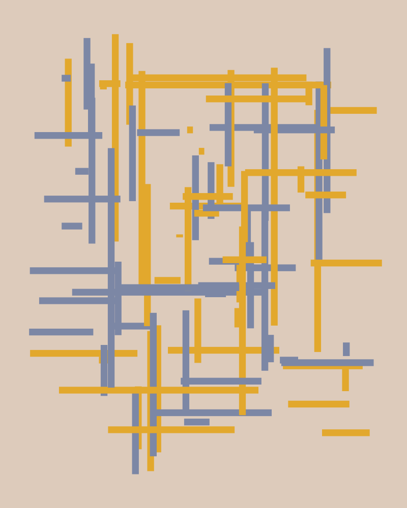
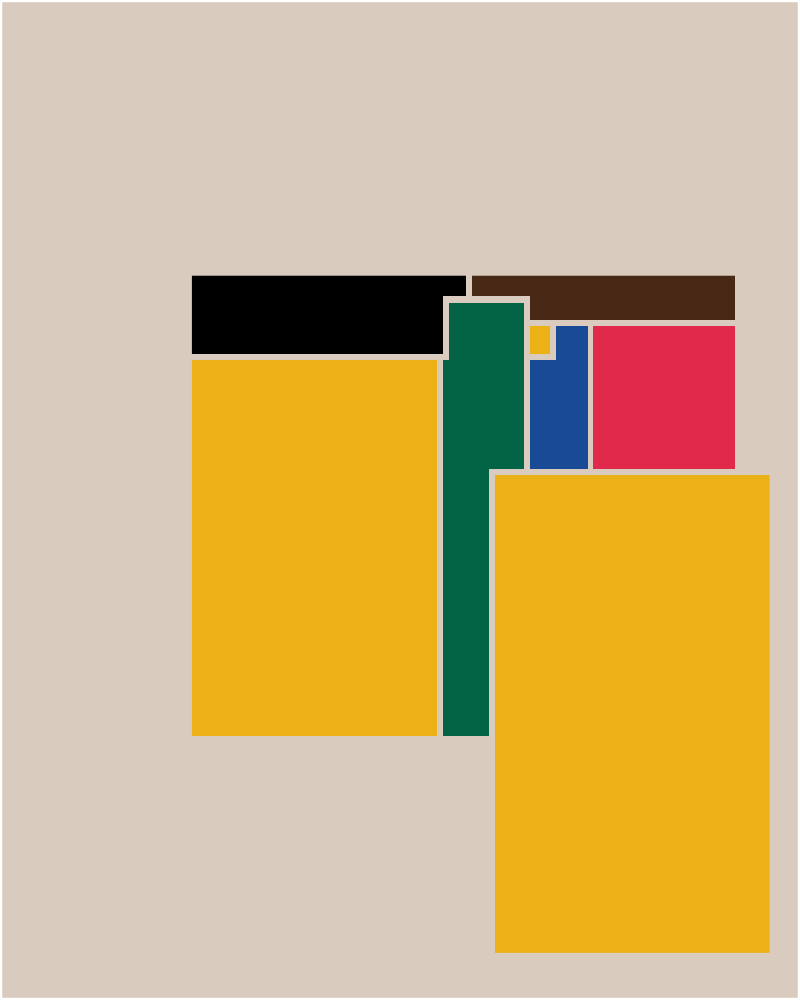
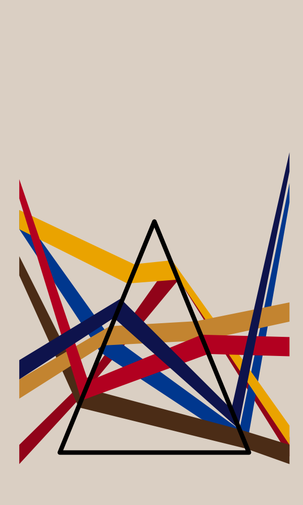

About
================

This repo is for showing the code and the final graphs for
the [TidyTuesday](https://github.com/rfordatascience/tidytuesday)
project.

Submissions
================

## 2022-09-06

## 2022-08-23

## 2022-08-23

## 2022-08-16

## 2022-03-22

## 2022-02-15

Du bois plate 23             |  Woven lines Du Bois style
:-------------------------:|:-------------------------:
 | 

Du bois plate 57            |  Squares Du Bois style
:-------------------------:|:-------------------------:
 | 

Du bois plate 61            |  Triangle Du Bois style
:-------------------------:|:-------------------------:
 | 

## 2022-02-01

## 2022-01-25

## 2022-01-18

## 2022-01-11

